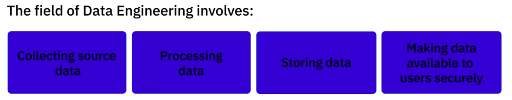

# Modern Data Ecosystem

## Key Concepts

- **Interconnected Entities**: Network of independent and evolving entities.
- **Data Integration**: Combining data from diverse sources.
- **Data Analysis**: Various types of analysis to generate insights.
- **Stakeholder Collaboration**: Active collaboration to act on insights.
- **Tools and Infrastructure**: Storage, processing, and dissemination of data.

## Data Sources

- **Variety of Data**: Structured and unstructured datasets (text, images, videos, etc.).
- **Acquisition**: Pull data into a repository, ensuring reliability, security, and integrity.

## Data Organization

- **Cleaning and Optimization**: Organize and clean data for user access.
- **Compliance**: Adhere to organizational standards and regulations.
- **Data Management**: Ensure high availability, flexibility, accessibility, and security.

## Data Utilization

- **Access by Stakeholders**: Business stakeholders, applications, programmers, and analysts.
- **Interfaces and APIs**: Provide data through tailored interfaces and APIs.

## Emerging Technologies

- **Cloud Computing**: Limitless storage and high-performance computing.
- **Machine Learning**: Predictive modeling using past data.
- **Big Data**: Handling massive and varied datasets with new tools and techniques.

## Roles in the Modern Data Ecosystem

### Data Engineers
- Develop and maintain data architectures.
- Extract, integrate, and organize data from various sources.
- Clean, transform, and prepare data for business operations and analysis.
- Ensure data accessibility for applications and stakeholders.

### Data Analysts
- Translate data into plain language for decision-making.
- Inspect, clean, and analyze data to derive insights.
- Identify correlations, find patterns, and apply statistical methods.
- Visualize data to present findings.

### Data Scientists
- Analyze data for actionable insights.
- Build Machine Learning and Deep Learning models for predictive analytics.
- Answer predictive questions using past data.
- Require knowledge of Mathematics, Statistics, programming, and domain expertise.

### Business Analysts
- Leverage insights from Data Analysts and Data Scientists.
- Assess implications for business and recommend actions.

### BI Analysts
- Focus on market forces and external influences.
- Organize and monitor data on business functions.
- Extract insights to improve business performance.

## What is Data Engineering?

1. **Collecting Data**: Developing tools and workflows to acquire data from multiple sources and designing scalable data architectures.
2. **Processing Data**: Cleaning, transforming, and preparing data for use, implementing distributed systems, and ensuring data quality and security.
3. **Storing Data**: Architecting data stores and ensuring scalability, privacy, and compliance.
4. **Making Data Available**: Using APIs, services, and dashboards to provide secure, rights-based access to data.

## Differences Between Databases, Data Warehouses, and Data Lakes

### Databases
- **Purpose**: Designed for transactional processing (OLTP) and storing structured data.
- **Data Structure**: Stores data in tables with rows and columns, enforcing a schema.
- **Use Case**: Ideal for applications requiring real-time data access and updates, such as customer relationship management (CRM) systems.

### Data Warehouses
- **Purpose**: Designed for analytical processing (OLAP) and storing historical data for reporting and analysis.
- **Data Structure**: Stores structured data, often aggregated and optimized for query performance.
- **Use Case**: Suitable for business intelligence (BI) and analytics, where data is queried to generate reports and insights.

### Data Lakes
- **Purpose**: Designed to store vast amounts of raw data in its native format, including structured, semi-structured, and unstructured data.
- **Data Structure**: Stores data as-is without enforcing a schema, allowing for flexibility in data ingestion.
- **Use Case**: Ideal for big data analytics, machine learning, and data exploration, where data scientists and analysts need access to raw data for various analyses.

## Responsibilities and Skillsets of a Data Engineer

### Responsibilities
- **Provide Analytics-Ready Data**: Ensure data is accurate, reliable, compliant, and accessible.
- **Extract, Organize, and Integrate Data**: From disparate sources.
- **Prepare Data for Analysis**: Transform and cleanse data.
- **Design and Manage Data Pipelines**: Oversee the journey of data from source to destination.
- **Setup and Manage Infrastructure**: For data ingestion, processing, and storage.

### Technical Skills
- **Operating Systems**: UNIX, Linux, Windows.
- **Infrastructure Components**: Virtual machines, networking, load balancing, cloud services (Amazon, Google, IBM, Microsoft).
- **Databases and Data Warehouses**:
  - RDBMS: IBM DB2, MySQL, Oracle, PostgreSQL.
  - NoSQL: Redis, MongoDB, Cassandra, Neo4J.
  - Data Warehouses: Oracle Exadata, IBM Db2 Warehouse, Amazon RedShift.
- **Data Pipelines**: Apache Beam, AirFlow, DataFlow.
- **ETL Tools**: IBM Infosphere, AWS Glue, Improvado.
- **Programming Languages**: SQL, Python, R, Java, Shell scripting.
- **Big Data Tools**: Hadoop, Hive, Spark.

### Functional Skills
- **Convert Business Requirements**: Into technical specifications.
- **Software Development Lifecycle**: Ideation, design, prototyping, testing, deployment, monitoring.
- **Understanding Data Applications**: In business and risks of poor data management (quality, privacy, security, compliance).

### Soft Skills
- **Interpersonal Skills**: Teamwork, collaboration, effective communication with technical and non-technical stakeholders.
