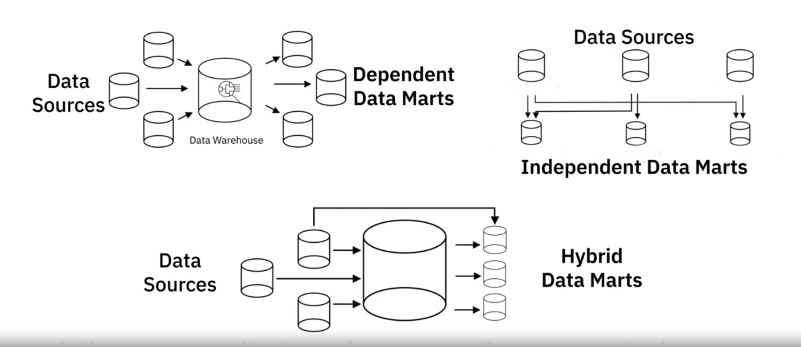
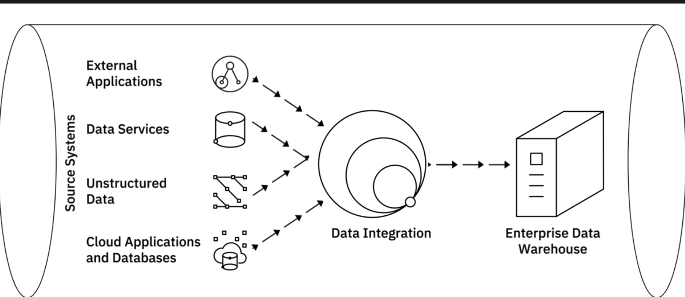

## Data Ecosystem

### Overview
A data engineer’s ecosystem includes the infrastructure, tools, frameworks, and processes for:
- Extracting data from disparate sources.
- Architecting and managing data pipelines for transformation, integration, and storage.
- Architecting and managing data repositories.
- Automating and optimizing workflows and data flow between systems.
- Developing applications needed through the data engineering workflow.

### Types of Data
- **Structured Data**: Organized into rows and columns (e.g., databases, spreadsheets).
- **Semi-Structured Data**: Mix of structured and unstructured data (e.g., emails).
- **Unstructured Data**: Complex, qualitative information (e.g., photos, videos, text files).

### Data Repositories
- **Transactional Systems (OLTP)**: Store high-volume operational data (e.g., banking transactions).
- **Analytical Systems (OLAP)**: Optimized for complex data analytics (e.g., data warehouses, data lakes).

### Data Integration
- Tools combine data from disparate sources into a unified view for users to query and manipulate.

### Data Pipelines
- Cover the journey of data from source to destination using processes like ETL (Extract-Transform-Load) or ELT (Extract-Load-Transform).

### Languages
- **Query Languages**: SQL for querying and manipulating data.
- **Programming Languages**: Python for developing data applications.
- **Shell and Scripting Languages**: For repetitive operational tasks.

### BI and Reporting Tools
- Collect and present data in visual formats (e.g., interactive dashboards) without requiring programming knowledge.

### Automation
- Automated tools, frameworks, and processes for all stages of the data analytics process.

## Types of Data

### Structured Data
- **Definition**: Well-defined structure, stored in schemas like databases, represented in rows and columns.
- **Sources**: SQL databases, OLTP systems, spreadsheets, online forms, sensors (GPS, RFID), network and web server logs.
- **Storage**: Relational or SQL databases.
- **Analysis**: Easily examined with standard data analysis methods and tools.

### Semi-Structured Data
- **Definition**: Some organizational properties, lacks a fixed schema, contains tags and elements for hierarchy.
- **Sources**: Emails, XML, binary executables, TCP/IP packets, zipped files, data integration from different sources.
- **Storage**: XML, JSON.
- **Analysis**: Requires specialized tools for hierarchical data.

### Unstructured Data
- **Definition**: No identifiable structure, cannot be organized in relational databases.
- **Sources**: Web pages, social media feeds, images, video and audio files, documents, PDFs, PowerPoint presentations, media logs, surveys.
- **Storage**: Files, documents, NoSQL databases.
- **Analysis**: Requires specialized tools for examining heterogeneous data.

## Data Sources

### Internal Sources
- **Relational Databases**: SQL Server, Oracle, MySQL, IBM DB2.
- **Applications**: Support business activities, customer transactions, HR activities.

### External Sources
- **Public and Private Datasets**: Government data, Point-of-Sale data, Financial data, Weather data.
- **Formats**: Flat files (CSV), spreadsheets (Excel, Google Sheets), XML documents.

### APIs and Web Services
- **Definition**: Interfaces for obtaining data from various sources.
- **Examples**: Twitter and Facebook APIs for sentiment analysis, Stock Market APIs, Data Lookup and Validation APIs.

### Web Scraping
- **Definition**: Extracting data from web pages.
- **Tools**: BeautifulSoup, Scrapy, Pandas, Selenium.
- **Uses**: Price comparisons, sales leads, forum data extraction, machine learning datasets.

### Data Streams
- **Sources**: Instruments, IoT devices, GPS data, social media posts.
- **Applications**: Apache Kafka, Apache Spark Streaming, Apache Storm.
- **Uses**: Financial trading, demand prediction, threat detection, sentiment analysis, industrial monitoring, web performance, flight rebooking.

### RSS Feeds
- **Definition**: Capturing updated data from forums and news sites.
- **Tools**: Feed readers for streaming updates to user devices.

## Overview of Data Repositories

A data repository is a general term for data that has been collected, organized, and isolated for business operations or analysis. It can range from small to large database infrastructures with one or more databases. In this video, we will provide an overview of different types of repositories such as databases, data warehouses, and big data stores.

### Databases
- **Definition**: A collection of data designed for input, storage, search, retrieval, and modification.
- **DBMS**: Database Management System, a set of programs that creates and maintains the database.
- **Types**:
  - **Relational Databases (RDBMS)**: Organize data in a tabular format with rows and columns, optimized for data operations and querying. Uses SQL.
  - **Non-Relational Databases (NoSQL)**: Schema-less, built for speed, flexibility, and scale. Used for processing big data.

### Data Warehouses
- **Definition**: Central repositories that merge information from disparate sources and consolidate it through the ETL (Extract, Transform, Load) process for analytics and business intelligence.
- **Related Concepts**: Data Marts and Data Lakes, which can be relational or non-relational.

### Big Data Stores
- **Definition**: Distributed computational and storage infrastructure to store, scale, and process very large data sets.

## NoSQL Databases

### Overview
NoSQL stands for "not only SQL" and refers to non-relational database designs that provide flexible schemas for data storage and retrieval. They are popular for their scalability, performance, and ease of use, especially in the era of cloud computing, big data, and high-volume web and mobile applications.

### Types of NoSQL Databases
1. **Key-Value Store**:
   - **Definition**: Data stored as key-value pairs.
   - **Uses**: User session data, real-time recommendations, in-memory data caching.
   - **Examples**: Redis, Memcached, DynamoDB.

2. **Document-Based**:
   - **Definition**: Each record and its data stored within a single document.
   - **Uses**: eCommerce platforms, medical records, CRM platforms, analytics.
   - **Examples**: MongoDB, DocumentDB, CouchDB, Cloudant.

3. **Column-Based**:
   - **Definition**: Data stored in cells grouped as columns.
   - **Uses**: Heavy write requests, time-series data, weather data, IoT data.
   - **Examples**: Cassandra, HBase.

4. **Graph-Based**:
   - **Definition**: Data represented and stored using a graphical model.
   - **Uses**: Social networks, real-time recommendations, network diagrams, fraud detection.
   - **Examples**: Neo4J, CosmosDB.

### Advantages of NoSQL
- **Handling Large Volumes**: Manages structured, semi-structured, and unstructured data.
- **Distributed Systems**: Scales across multiple data centers, leveraging cloud infrastructure.
- **Cost-Effective**: Scale-out architecture with additional capacity and performance.
- **Agility and Flexibility**: Simpler design, better control over availability, improved scalability.

### Key Differences Between RDBMS and NoSQL
- **Schema**: RDBMS has rigid schemas; NoSQL is schema-agnostic.
- **Cost**: RDBMS is expensive; NoSQL is designed for low-cost hardware.
- **ACID Compliance**: RDBMS supports ACID transactions; most NoSQL databases do not.
- **Maturity**: RDBMS is a mature technology; NoSQL is relatively newer but increasingly used for critical applications. 

## Data Warehouses, Data Marts and Data Lakes 

### Data Warehouses
- **Definition**: Central repositories of integrated data from multiple sources.
- **Characteristics**: Serve as the single source of truth, storing current and historical data that is cleansed, conformed, and categorized.
- **Architecture**: Typically three-tier (database servers, OLAP server, client front-end layer).
- **Benefits**: Lower costs, limitless storage and compute capabilities, scalable, faster disaster recovery.
- **Use Cases**: Massive amounts of data from operational systems for reporting and analysis.
- **Examples**: Teradata, Oracle Exadata, IBM Db2, Amazon RedShift, Google BigQuery, Snowflake.

### Data Marts
- **Definition**: Sub-sections of data warehouses for specific business functions or user communities.
- **Types**: Dependent, independent, and hybrid data marts.
- **Purpose**: Provide relevant data to users, accelerate business processes, cost and time-efficient decision-making, improve response times, secure access.
- **Examples**: Sales or finance groups accessing data for quarterly reporting.

### Data Lakes
- **Definition**: Repositories for large amounts of structured, semi-structured, and unstructured data in their native format.
- **Characteristics**: Store raw data without predefined structure or schema, classified, protected, and governed.
- **Benefits**: Store all types of data, scalable, save time on defining structures, repurpose data for various use cases.
- **Technologies**: Cloud Object Storage (Amazon S3), Apache Hadoop, relational and NoSQL databases.
- **Examples**: Amazon, Cloudera, Google, IBM, Microsoft, Snowflake.

### Data Lakehouse
- **Definition**: Combines the flexibility and cost-effectiveness of a data lake with the performance and structure of a data warehouse.
- **Benefits**: Low-cost storage, built-in data management and governance, supports both BI and high-performance machine learning workloads.
- **Use Cases**: Modernizing existing data lakes, complementing data warehouses for AI and machine learning workloads.

## Data Movement Approaches

### ETL (Extract, Transform, Load)
- **Definition**: Automated process to convert raw data into analysis-ready data.
- **Steps**:
  - **Extract**: Collect data from source locations.
    - **Batch Processing**: Move data in large chunks at scheduled intervals (e.g., Stitch, Blendo).
    - **Stream Processing**: Pull data in real-time and transform in transit (e.g., Apache Samza, Apache Storm, Apache Kafka).
  - **Transform**: Convert raw data into usable data.
    - Examples: Consistent date formats, removing duplicates, filtering unnecessary data, enriching data, establishing key relationships, applying business rules.
  - **Load**: Transport processed data to a destination system.
    - Types: Initial loading, incremental loading, full refresh.
    - Load verification: Check for missing/null values, server performance, monitor load failures.
- **Tools**: IBM Infosphere Information Server, AWS Glue, Improvado, Skyvia, HEVO, Informatica PowerCenter.

### ELT (Extract, Load, Transform)
- **Definition**: Extracted data is first loaded into the target system, then transformed.
- **Destination**: Typically a data lake, but can also be a data warehouse.
- **Advantages**:
  - Shortens cycle between extraction and delivery.
  - Allows ingestion of large volumes of raw data immediately.
  - Greater flexibility for exploratory data analytics.
  - Transforms only required data for specific analysis.
  - More suited for Big Data.

### Data Pipelines
- **Definition**: Broader term encompassing the entire journey of moving data from one system to another.
- **Types**:
  - **Batch Processing**: Long-running batch queries.
  - **Streaming Data**: Continuous flow of data processing/transformation.
  - **Combination**: Mix of batch and streaming data.
- **Destination**: Typically a data lake, but can also be other applications or visualization tools.
- **Tools**: Apache Beam, AirFlow, DataFlow.

In this video, we learned about different data movement approaches—ETL, ELT, and Data Pipelines, and how they facilitate the journey of data from source to destination systems.

## Data Integration Platforms 

