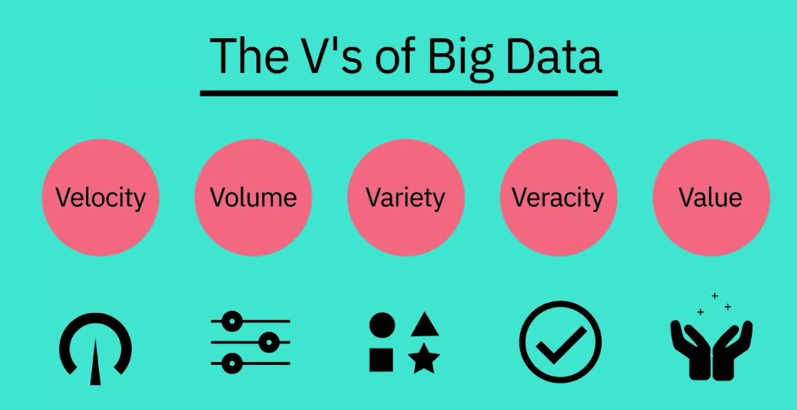

# Big Data

Big Data refers to the vast amounts of data generated daily from internet-connected devices. It requires innovative and scalable technology for collection, hosting, and analytical processing to derive real-time business insights.

## The V's of Big Data
1. **Velocity**: Speed of data generation.
2. **Volume**: Scale of data.
3. **Variety**: Diversity of data types.
4. **Veracity**: Quality and accuracy of data.
5. **Value**: Turning data into valuable insights.

### Tools for Big Data
Tools like Apache Spark and Hadoop leverage distributed computing to handle Big Data, providing new insights and enhancing services.

## Big Data Processing Technologies

Big Data processing tools like Hadoop, HDFS, Hive, and Spark enable handling large datasets. 

- **Hadoop**: Provides distributed storage and processing of big data across clusters. Scalable and cost-effective, it supports various data formats and offers real-time access.
- **HDFS**: A component of Hadoop, it partitions files over multiple nodes, ensuring fault tolerance and parallel processing.
- **Hive**: A data warehouse on Hadoop for querying and analyzing large datasets. Suitable for ETL and reporting but has high latency and is read-based.
- **Spark**: A versatile data processing engine for real-time analytics, supporting in-memory processing and multiple programming languages. Integrates with HDFS and Hive.

These tools enhance data handling, scalability, and real-time analytics capabilities.

### Difference Between Hive and Spark

- **Hive**:
  - **Purpose**: Data warehouse software for reading, writing, and managing large datasets.
  - **Built On**: Hadoop.
  - **Use Case**: Suitable for ETL, reporting, and data analysis.
  - **Performance**: High latency, not suitable for applications needing fast response times.
  - **Operation Type**: Read-based, not ideal for transaction processing with high write operations.
  - **Query Language**: SQL-like (HiveQL).

- **Spark**:
  - **Purpose**: General-purpose data processing engine for real-time analytics.
  - **Built On**: Can run standalone or on top of Hadoop.
  - **Use Case**: Interactive analytics, stream processing, machine learning, data integration, and ETL.
  - **Performance**: In-memory processing for high-speed computations, spilling to disk only when necessary.
  - **Operation Type**: Supports both read and write operations efficiently.
  - **Programming Interfaces**: Supports Java, Scala, Python, R, and SQL.