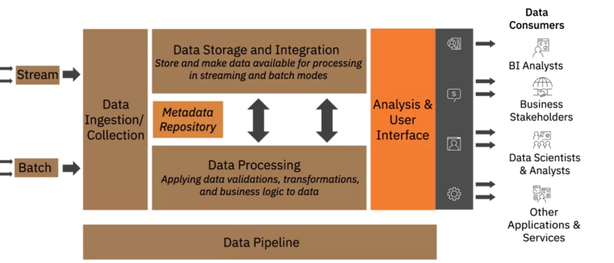

# Data Platform 

## Factors for selecting and designing data store

A data store, or data repository, refers to collected, organized, and isolated data for business operations or analysis. Types include databases, data warehouses, data marts, big data stores, and data lakes. Key considerations for designing a data store include:

- **Type of Data**: Structured (RDBMS) vs. Semi-structured/Unstructured (NoSQL).
- **Volume of Data**: Large volumes may require data lakes or big data stores.
- **Intended Use**: Transactional systems need high-speed operations; analytical systems need complex query support.
- **Storage Considerations**: Performance, availability, integrity, and recoverability.
- **Privacy, Security, and Governance**: Compliance with regulations like GDPR, CCPA, and HIPAA.

Designing a data store involves choosing the right type of database, considering data volume and usage, ensuring scalability, and implementing robust security and governance strategies.

## Security

Enterprise-level data platforms and repositories must address security at multiple levels. Key components of an effective information security strategy include:

- **CIA Triad**:
  - **Confidentiality**: Control unauthorized access.
  - **Integrity**: Ensure resources are trustworthy and untampered.
  - **Availability**: Ensure authorized users have access when needed.

### Levels of Security

1. **Physical Infrastructure Security**:
   - Secure access to facilities.
   - Redundant power supplies and environmental controls.
   - Location considerations to avoid natural threats.

2. **Network Security**:
   - Firewalls and network access control.
   - Network segmentation and security protocols.
   - Intrusion detection and prevention systems.

3. **Application Security**:
   - Built-in security from the foundation.
   - Threat modeling, secure design, coding practices, and testing.

4. **Data Security**:
   - **Data at Rest**: Encryption to protect stored data.
   - **Data in Transit**: Encryption methods like HTTPS, SSL, and TLS.
   - Authentication and authorization systems.

### Monitoring and Compliance

- Proactive monitoring and integration of security processes.
- Security monitoring and intelligence systems for audit history, compliance, and timely reaction to violations.

Every enterprise should have a comprehensive security policy involving business, IT, and stakeholders to achieve security goals through people, policies, processes, systems, and tools.
